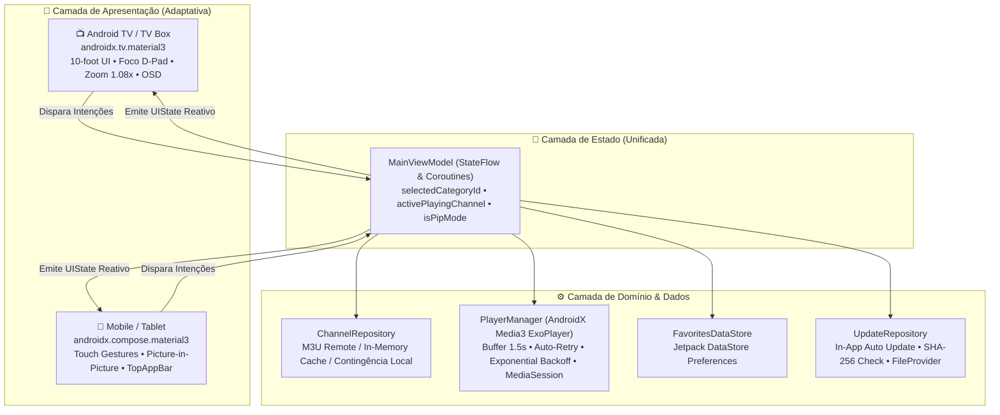

<div align="center">

# 📺 GabesTV

### *Reprodutor IPTV Nativo, Híbrido e de Alta Performance para Android TV, Google TV e Mobile.*

[](https://kotlinlang.org)
[-3DDC84?style=for-the-badge&logo=android&logoColor=white)](https://developer.android.com)
[](https://developer.android.com/jetpack/compose)
[](https://developer.android.com/media/media3)
[](https://dagger.dev/hilt/)
[](.github/workflows/build-apk.yml)
[](.github/workflows/security-scan.yml)
[](LICENSE)

<br/>

> **GabesTV** é um reprodutor de IPTV moderno e open-source construído em **Kotlin puro** e **Jetpack Compose**, projetado com uma arquitetura híbrida inteligente capaz de proporcionar uma experiência de **10-foot UI imersiva para Smart TVs** (Google TV, Android TV, Fire TV) e uma **interface fluida com gestos touch e Picture-in-Picture para Smartphones e Tablets**.

🌐 **[Demonstração Interativa Web (Landing Page)](https://gdspereira.github.io/GabesTV/)** &nbsp;|&nbsp; 📥 **[Baixar Última Release (APK)](https://github.com/GdsPereira/GabesTV/releases/latest)** &nbsp;|&nbsp; 🛡️ **[Política de Segurança](SECURITY.md)**

</div>

---

## 💡 A Motivação

Grande parte dos reprodutores de IPTV disponíveis no ecossistema Android sofrem com os mesmos gargalos crônicos:
- **Interfaces lentas baseadas em WebViews** ou forks antigos de players legados;
- **Navegação quebrada em Smart TVs**, exigindo o uso de ponteiros de mouse virtuais na tela;
- **Buffering excessivo (5 a 10 segundos de tela preta)** a cada troca de canal;
- **Falta de interoperabilidade**, funcionando apenas na TV ou apenas no smartphone.

O **GabesTV** foi desenvolvido para resolver esses desafios na raiz: código 100% nativo em Compose, renderização direta em 60/120 fps, **buffer inicial ultra-otimizado de apenas 1,5s para zapping instantâneo**, foco ergonômico guiado por D-Pad e detecção automática de ambiente de execução.

---

## 📱📺 Arquitetura Dual: Android TV vs Mobile

O GabesTV adota o princípio de **Single Core, Adaptive Presentation**. Toda a camada de regras de negócio, streaming e persistência é compartilhada de forma reativa através de Unidirectional Data Flow (UDF), enquanto a camada visual adapta-se ao tipo de dispositivo em runtime via [`DeviceType.kt`](app/src/main/java/com/gabestv/iptv/ui/util/DeviceType.kt).



### Comparativo de Recursos por Plataforma

| Recurso / Aspecto | 📺 Modo Smart TV (10-foot UI) | 📱 Modo Smartphone & Tablet |
| :--- | :--- | :--- |
| **Biblioteca de UI** | `androidx.tv.material3` & `tv.foundation` | `androidx.compose.material3` padrão |
| **Navegação** | Totalmente orientada ao D-Pad (Controle Remoto) | Gestos Touch, Drag & Scroll suave |
| **Feedback de Foco** | Escala 1.08x, brilho periférico e elevação de cards | Ripple effects e animações Material You |
| **HUD / OSD** | Overlay cinematográfico temporizado (4s) | Controles touch com overlay retrátil |
| **Controles de Reprodução** | Botões físicos do controle (`OK`, `CH+`, `CH-`) | Gestos verticais de Brilho (esquerda) e Volume (direita) |
| **Picture-in-Picture (PiP)** | N/A (Tela cheia imersiva) | Suporte nativo em segundo plano (`supportsPictureInPicture`) |
| **Launcher** | Suporte a `LEANBACK_LAUNCHER` com banner 320x180 | Ícone padrão adaptativo com `LAUNCHER` |

---

## ⚡ Diferenciais de Engenharia

### 1. Zapping Ultrarrápido (Buffer de 1,5s)
A troca de canais ao vivo utiliza uma configuração personalizada de `DefaultLoadControl` no Media3 ExoPlayer:
- **Buffer inicial para início da reprodução:** 1.500 ms (1,5 segundos);
- **Buffer para retomada após rebuffering:** 2.500 ms;
- **Buffer máximo em memória:** 5.000 ms.
Isso reduz a latência de troca de canal em mais de 70% em comparação com os players convencionais.

### 2. Resiliência de Rede & Auto-Reconexão
Streams IPTV frequentemente sofrem com instabilidade temporária. O GabesTV implementa um gerenciador com **exponential backoff**, tentando reconectar de forma invisível para o usuário antes de emitir qualquer erro bloqueante.

### 3. OkHttp Data Source Permissivo
Muitos servidores de transmissão e instâncias locais do Threadfin/Jellyfin utilizam portas não convencionais ou certificados locais. O `PlayerManager` é acoplado a um `OkHttpDataSource.Factory` com headers personalizados (`User-Agent`, `Referer`), garantindo compatibilidade universal.

### 4. Sistema de Atualização In-App (OTA)
O app possui um fluxo completo de atualização automática via [`UpdateRepository.kt`](app/src/main/java/com/gabestv/iptv/data/UpdateRepository.kt) e [`UpdateDialog.kt`](app/src/main/java/com/gabestv/iptv/ui/components/UpdateDialog.kt):
- Checagem periódica contra manifesto remoto `version.json`;
- Download em segundo plano com indicador de progresso;
- Validação criptográfica do binário baixado via hash **SHA-256**;
- Instalação segura via Android `FileProvider`.

---

## 🎮 Mapeamento de Comandos & Ergonomia

### 📺 Controle Remoto (Smart TV)
| Botão / Tecla | No Player (Tela Cheia) | Na Grade / Menu |
| :--- | :--- | :--- |
| <kbd>◀ Esquerda</kbd> / <kbd>CH -</kbd> | Canal Anterior (Zapping instantâneo) | Navegar até o Drawer de Categorias |
| <kbd>▶ Direita</kbd> / <kbd>CH +</kbd> | Próximo Canal (Zapping instantâneo) | Navegar para os Cards de Canais |
| <kbd>▲ Cima</kbd> / <kbd>▼ Baixo</kbd> | Exibir / Ocultar HUD com detalhes | Navegar verticalmente pela lista |
| <kbd>OK</kbd> / <kbd>Enter</kbd> | Pausar / Retomar reprodução | Abrir canal selecionado |
| <kbd>Voltar</kbd> / <kbd>Back</kbd> | Voltar para a grade de canais | Sair da aplicação |

### 📱 Gestos Touch (Mobile)
- **Deslizar na vertical (lado esquerdo da tela):** Ajuste fino de Brilho da tela;
- **Deslizar na vertical (lado direito da tela):** Ajuste fino de Volume de áudio;
- **Dois toques rápidos:** Alternar entre Play e Pause;
- **Botão PiP:** Minimiza a transmissão em janela flutuante para multitarefa.

---

## 🛠️ Stack Tecnológica

| Componente | Tecnologia | Finalidade |
| :--- | :--- | :--- |
| **Linguagem** | [Kotlin 1.9.24](https://kotlinlang.org/) | Código 100% conciso, seguro e moderno |
| **UI TV** | [Compose for TV M3](https://developer.android.com/jetpack/compose/tv) (`1.0.0-rc02`) | Design system oficial do Google para Android TV |
| **UI Mobile** | [Jetpack Compose Material 3](https://developer.android.com/jetpack/compose) | Componentes táteis modernos com tema escuro imersivo |
| **Player Engine** | [AndroidX Media3 ExoPlayer 1.3.1](https://developer.android.com/media/media3) | Decodificação HLS (`.m3u8`), MPEG-TS (`.ts`) e buffer fino |
| **DI** | [Dagger Hilt 2.51.1](https://dagger.dev/hilt/) + KSP | Injeção de dependências desacoplada e testável |
| **Networking** | [OkHttp 4.12](https://square.github.io/okhttp/) | Cliente HTTP com logging, headers IPTV e tolerância SSL |
| **Imagens & Vetores**| [Coil 2.6](https://coil-kt.github.io/coil/) + SVG Decoder | Renderização nítida de logotipos de canais em até 4K |
| **Persistência** | [Jetpack DataStore](https://developer.android.com/topic/libraries/architecture/datastore) | Armazenamento reativo de canais favoritos |
| **Concorrência** | Coroutines & `StateFlow` | Fluxo unidirecional de dados (UDF) reativo |
| **Testes** | JUnit 4, Google Truth, MockK, Coroutines Test | Testes unitários para Repository, Parser e ViewModel |

---

## 🚀 Como Compilar e Rodar

### Pré-requisitos
- **JDK:** Versão 17 ou 21
- **Android SDK:** Compile SDK 34 / Min SDK 24
- **Gradle:** 8.6 (usando o wrapper `./gradlew` incluso)

### 1. Clonar o Repositório
```bash
git clone https://github.com/GdsPereira/GabesTV.git
cd GabesTV
```

### 2. Compilar o APK
Para compilar a versão Debug:
```bash
# Windows (PowerShell)
$env:JAVA_HOME="C:\caminho\para\seu\jdk-21"; ./gradlew assembleDebug

# Linux / macOS
./gradlew assembleDebug
```
O APK compilado estará disponível em: `app/build/outputs/apk/debug/app-debug.apk`.

### 3. Executar os Testes Unitários
```bash
./gradlew test
```

### 4. Instalar na Smart TV via Wi-Fi (ADB)
Com a depuração de rede ativa na sua TV:
```bash
# 1. Conectar ao IP da sua Smart TV
adb connect 192.168.1.150:5555

# 2. Instalar o aplicativo
adb install -r app/build/outputs/apk/debug/app-debug.apk
```

---

## 🛡️ DevSecOps & Governança de Qualidade

O repositório possui uma esteira contínua de segurança (Shift-Left) automatizada no GitHub Actions:

- 🔍 **CodeQL SAST:** Análise estática profunda em busca de vulnerabilidades de código Kotlin/Java;
- 🔑 **Gitleaks:** Scanner contínuo de histórico e Pull Requests para prevenção contra vazamento de credenciais;
- 📦 **Trivy Scanner:** Auditoria contínua de CVEs conhecidas nas dependências Gradle;
- 🛡️ **MobSFscan:** Inspeção estática de segurança diretamente sobre o manifesto e o binário APK;
- 📜 **SBOM (Software Bill of Materials):** Geração automática de relatórios CycloneDX e SPDX a cada release;
- 🔒 **R8 / ProGuard:** Regras estritas de ofuscação e *dead-code elimination* validadas para Media3, OkHttp, Hilt e modelos.

Para detalhes sobre relato responsável de vulnerabilidades, leia nosso [SECURITY.md](SECURITY.md).

---

## 📁 Estrutura do Código

```
GabesTV/
├── app/
│   ├── src/main/
│   │   ├── assets/
│   │   │   └── sample_channels.m3u          # Playlist local de contingência
│   │   ├── java/com/gabestv/iptv/
│   │   │   ├── data/                        # Repositórios (canais, favoritos, OTA)
│   │   │   ├── di/                          # Módulos Dagger Hilt
│   │   │   ├── model/                       # Modelos de domínio imutáveis
│   │   │   ├── parser/                      # Parser M3U/M3U8 de alta performance
│   │   │   ├── player/                      # Engine Media3 ExoPlayer e buffers
│   │   │   ├── ui/
│   │   │   │   ├── components/              # Cards de canal com zoom, drawers, badges
│   │   │   │   ├── mobile/                  # Layout touch mobile e top bar
│   │   │   │   ├── player/                  # Fullscreen player OSD e controles touch
│   │   │   │   ├── theme/                   # Tema escuro OLED/LED com paleta cinematográfica
│   │   │   │   └── util/                    # Detecção de dispositivo (TV vs Mobile)
│   │   │   └── viewmodel/                   # MainViewModel (Single Source of Truth)
│   │   └── AndroidManifest.xml              # Suporte unificado Leanback + Phone
├── docs/                                    # Landing Page interativa com simulador Web
├── .github/workflows/                       # Pipelines de CI/CD, DevSecOps e Releases
└── build.gradle.kts                         # Configuração central de build
```

---

## 📄 Licença

Distribuído sob a licença **MIT**. Consulte o arquivo [LICENSE](LICENSE) para obter mais informações.

<div align="center">
Desenvolvido com dedicação por <b><a href="https://github.com/GdsPereira">Gabriel Pereira</a></b>
</div>
